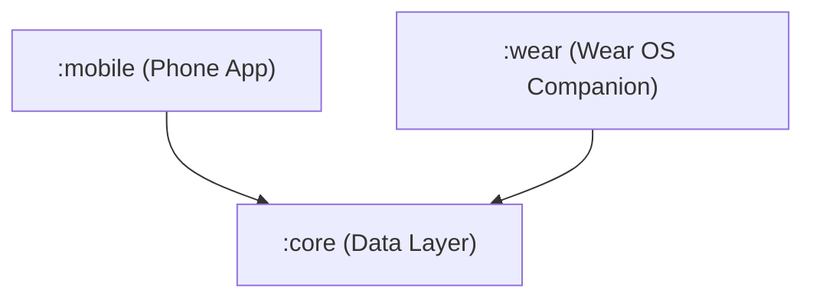

# AuraJournal: Privacy-First Local AI Voice Journal

AuraJournal is a minimalist, sensory-friendly voice reflection and mood insight tracker built to operate entirely on-device. By combining local speech-to-text transcription with local natural language heuristic processing, AuraJournal ensures that personal reflections never leave the device.

---

## Key Features

1. **One-Tap Voice Logging**: Tap the glowing microphone button on the Home Screen to record up to a 60-second voice reflection.
2. **Offline Speech-to-Text**: Utilizes Android's system-level, offline-capable `SpeechRecognizer` API to transcribe speech in real-time without sending audio payload bytes to external servers.
3. **Local AI Analysis**: Instantly extracts core themes (Career, Relationships, Fitness, Sleep, etc.), stress indicators (Low/Medium/High), and habit completion flags locally using heuristics, with full support/fallback structures for Gemini Nano (AICore) on compatible flagship hardware.
4. **Interactive Dashboard**: Premium weekly stress trends and habit trackers visualized with glowing Compose Canvas graphics.
5. **Wear OS Companion**: A lightweight Wear OS watch app to capture quick voice entries that automatically sync with the companion phone.
6. **Privacy Controls**: Direct options in Settings to backup all entries to a JSON payload or completely wipe the local SQLite database.

---

## Module Architecture

The project is structured as a multi-module Gradle project:



- **`:core`**: A shared library enclosing SQLite Room schema entities (`JournalEntry`), DAO queries (`JournalDao`), database migrations, and shared data transfer converters.
- **`:mobile`**: Main phone application containing Compose UI views (`HomeScreen`, `DetailScreen`, `DashboardScreen`, `SettingsScreen`, `OnboardingScreen`, `PremiumScreen`), AdMob/Firebase placeholders, Play Store review SDK triggers, and local STT + AI managers.
- **`:wear`**: Wear OS companion module allowing users to trigger 60-second voice reflection recordings directly from their wrist.

---

## Build & Run Instructions

To compile the application debug binaries:

```bash
./gradlew assembleDebug
```

### Requirements
- Android SDK 34+
- Gradle 9.4.1 (configured in the wrapper)
- Kotlin 1.9.20
- Jetpack Compose (BOM 2024.02.01)

### Required Permissions
- `android.permission.RECORD_AUDIO`: Required to record and process voice reflections locally.
- `android.permission.INTERNET` & `ACCESS_NETWORK_STATE`: Configured for Firebase analytic event dispatching and standard AdMob test banner rendering.
